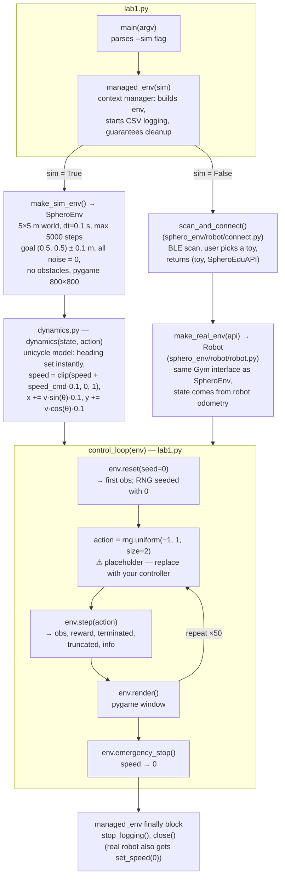
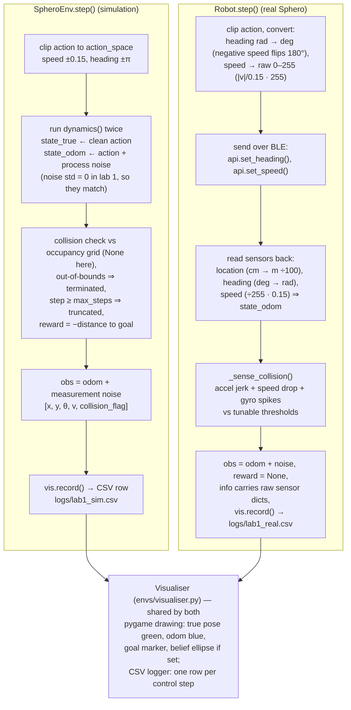

# Lab 1 — code flow block diagram

How `lab1.py` runs, end to end, and where every piece of data lives.
Run with `python lab1.py --sim` (simulation) or `python lab1.py` (real Sphero).

## Key data formats

| Data | Shape / meaning |
|---|---|
| `state` | `[x, y, heading, speed]` — metres, radians, m/s. Heading `0` points **+y**, positive rotates toward **+x** (matches Sphero heading degrees) |
| `action` | `[speed_cmd, heading_cmd]` — clipped by the env to speed ±0.15 m/s, heading ±π rad |
| `obs` | `[x, y, heading, speed, collision_flag]` — odometry state + measurement noise (noise std = 0 in lab 1 sim) |
| `info` dict | `state_true`, `state_odom`, `collision`, commands; the real robot also adds raw accel/gyro/velocity sensor dicts |
| CSV logs | `logs/lab1_sim.csv` or `logs/lab1_real.csv` — one row per `step()` (ground truth, odometry, action, estimate, setpoint) |

## Overall flow

## Inside `env.step(action)` — sim vs real

## Points worth knowing before you edit

- **Where to put your controller:** the `rng.uniform(-1, 1, 2)` line in `control_loop()` is the only thing meant to be replaced in lab 1. Compute `[speed_cmd, heading_cmd]` from `obs` instead.
- **Actions get clipped:** the env clips speed to ±0.15 m/s, so the random ±1.0 samples mostly saturate the speed command.
- **Heading convention:** 0 rad = +y ("north"), positive angles rotate toward +x. `wrap_angle()` keeps everything in [−π, π).
- **`dynamics.py` is yours to improve:** the sim uses it for *both* ground truth and odometry. Note it snaps heading instantly, unlike `SpheroEnv._base_dynamics` which rate-limits turns and only translates when aligned.
- **Sim and real are interchangeable:** `SpheroEnv` and `Robot` expose the same `reset / step / render / emergency_stop` interface, so `control_loop` doesn't care which one it gets — that's the whole point of `managed_env`.
- **Reward differs:** sim returns `−distance_to_goal` (minus collision penalty); the real robot returns `None` (no ground truth available).
- **Logs:** every step appends a CSV row via the shared `Visualiser`; cleanup in `managed_env` closes the file, so let the program exit normally (Ctrl+C mid-run can lose the log tail).
